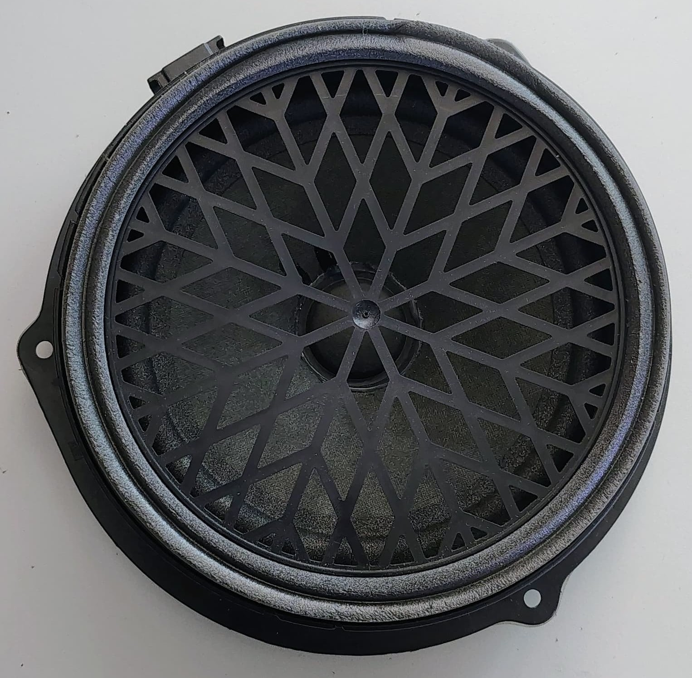
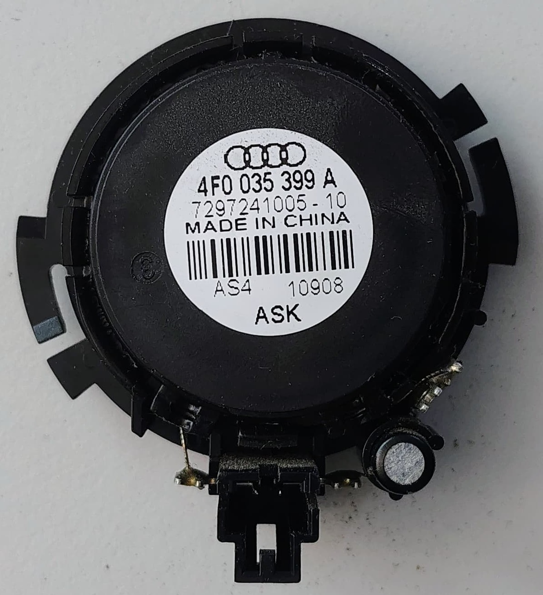

# Door Parts

## Door Control Unit (Part No. 8K0 959 794)

* Electronic unit responsible for controlling various door functions.
* Probably manages power windows, central locking and lights.

## Inner Door Panel (Door Card)

* The interior trim panel covering the inner metal structure of the car door.
* Provides mounting points for switches (window, lock), speakers, door handle, armrest, and storage pockets.

## Door Speaker

* Door speaker, most likely a woofer or mid-bass driver, designed for lower to mid-range frequencies.
* Includes the electrical connector for attaching the speaker wire harness.

## Tweeter / Midrange Speaker (Part No. 4F0 035 399 A)

* Smaller speaker for higher frequency sounds (treble).
* Audi OEM part, manufactured by ASK.

## Window Regulator Mechanism

* Mechanical assembly that guides and moves the door window glass up and down.
* Cable-type regulator, using cables, pulleys, and guide rails.
* Driven by a separate electric motor via a gear wheel.

## Window Motor (Part No. 8K0 959 812)

* Electric motor providing power to operate the window regulator.
* Also an Audi OEM part but manufactured by Brose and Siemens VDO.
* Connects electrically to the Door Control Module and mechanically to the regulator.

## Window Seals and Trim

* **Window Glass Run Channel Seal:** Rubber/felt seal lining the channel where the window glass slides.
* **Window Frame Trim (last two pictures):** Plastic trim covering the window flass rubber and outer metal frame around the window opening.
