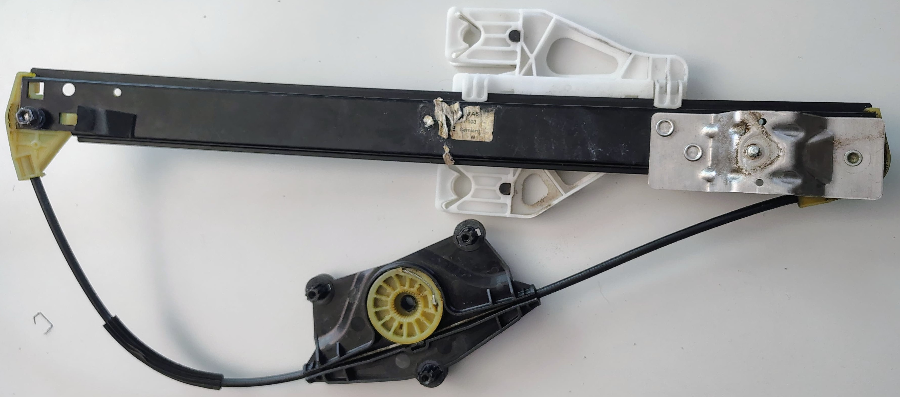
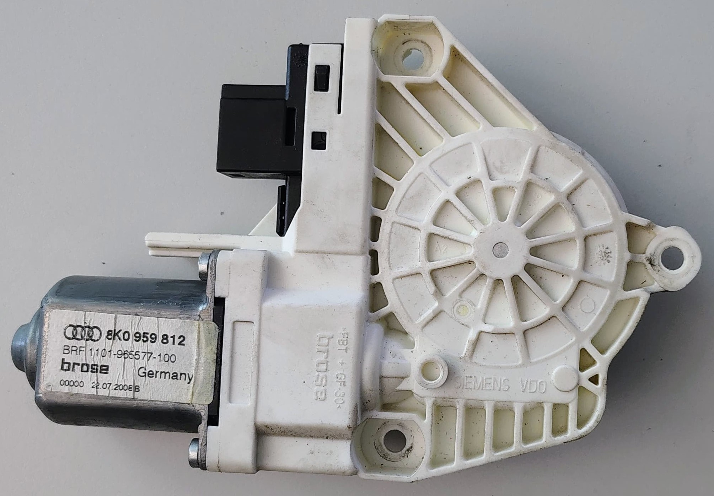

# Requirements specification

## Sustainability Contributions

**Reuse:** Direct reuse of functional parts (control units, motors, panels, speakers, regulators) extends the lifespan of vehicles and reduces demand for new manufacturing, lowering overall environmental impact.

**Material Recycling:** Components that cannot be reused are often dismantled for raw materials-metals, plastics, and rubber-which are then processed and used in new products, including sustainable building materials and new automotive parts.

**Circular Economy:** The recycling and repurposing of automotive parts support a circular economy, conserving resources, reducing landfill waste, and minimizing the carbon footprint associated with producing new materials

## Requirements

The car door to be dissambled is [Audi A4 B8](https://de.wikipedia.org/wiki/Audi_A4_B8).

The robot shall identify at least 5 distinct car door components using object detection algorithms with at least 80% accuracy.

The robot shall determine the specific tools required to handle each component.

The robot shall identify each tool required using object detection algorithms.

At least 3 actions to be performed by the robot:

- The robot shall be able to pull the cables.
- The robot shall be able to perform unscrewing action.
  - The robot shall be able to identify what type of screwdriver is required based on the screw (size, shape).
  - The robot shall be able to pick up the screwdriver, hold it securely, and perform the action.
  - The robot shall end the action when the screw has been unscrewed.
- The robot shall be able to perform panel removal.
  - The robot shall be able to disattach the panel.
  - The robot shall be able to hold the panel, and remove it.

Identify and define at least 3 key performance metrics to validate the robot’s skills in car door disassembly.

- Speed
- Accuracy
- Condition of disassembled parts
  
## Parts that could be removed by the robot

- Door panel
  - Pull at mounting points
  - Can be dismatled further
- Main cable harness
  - Robot can pull at different locations, trace the cable
  - Unplug the cable?
- Tweeter speaker
  - Requires cable to be removed first
  - Can be rotated and pulled from the panel
- Control Unit
  - Requires cables to be removed first
  - Has 3 mounting clips
  - 1 clip can be pressed and pulled
  - Afterwards the control unit can be pulled in one direction to remove
- Speaker
  - Requires tool: screwdriver
  - Requires cable to be removed first
  - 3 screws need to be removed first
  - Afterwards the speaker can be pulled from its mounting points as it's lightly glued to the door with adhesive insulation
- Window motor
  - Requires tool: screwdriver
  - Requires cable to be removed first
  - 3 screws need to be removed
  - Can be pulled from the door immediately afterwards

## Parts that would need to be removed by a human or would require human assistance

- Window
- Door frame
- Cables

## Parts which can be recycled

Also, see our parts list [here](door_parts.md) and the [official Audi spare parts list](https://audi-tradition-parts.de/en_GB/spare-parts/b-series-audi-80-a4/audi-a4-avant-s4-rs-4-allroad-b8-2008-2016).

| Image                                                                                                                                                              | Component                  | Reusable as Part | Recyclable Materials | Systanability Contribution                                |
| ------------------------------------------------------------------------------------------------------------------------------------------------------------------ | -------------------------- | ---------------- | -------------------- | --------------------------------------------------------- |
|                                                                                  | Door Control Unit          | Yes              | Electronics/Plastics | Reduces e-waste, extends part life                        |
|                                                                                     | Inner Door Panel           | Yes              | Plastics/Fabrics     | Reuse, e-waste reduction                                  |
|   | Door Speaker/Tweeter       | Yes              | Metals/Plastics      | Reuse, e-waste reduction, should be tested automatically  |
|                                                                     | Window Regulator Mechanism | Yes              | Metals               | Reuse, material recycling                                 |
|                                                                                     | Window Motor               | Yes              | Metals/Electronics   | Reuse, material recycling, should be tested automatically |
|                                                                                       | Windows Seals and Trim     | Sometimes        | Rubber/Plastics      | Material recycling                                        |

**1. Door Control Unit (Part No. 8K0 959 794):**

- Reusability: High.
- These electronic modules can often be reused in other vehicles or refurbished. (TODO: Source)
- Sustainability Impact: Reduces electronic waste and the need for new manufacturing resources.

**2. Inner Door Panel:**

- Reusability: Moderate.
- Rubber seals and plastic trims can be reused if in good condition. See spare part info [here](https://audi-tradition-parts.de/en_GB/p/door-trim-8k0867103d-wfe-14?category=118943).
- Sustainability Impact: Reusing these components reduces the demand for new materials.

**3. Speakers (Including Tweeter Part No. 4F0 035 399 A):**

- Reusability: High.
- Speakers can be tested and reused in other vehicles or audio projects. See spare part info [here](https://shop.ahw-shop.de/original-audi-a4-a5-b8-tieftonlautsprecher-hutablage-tieftoener-aktiv-bass-lautsprecher-8t0035412?c=2475).
- Sustainability Impact: Extends the lifecycle of electronic components, reducing e-waste.

**8. The remaining steel/Aluminum Frame:**

- It can be melted for new door parts. See more info [here](https://www.audi.co.nz/en/stories/sustainability/the-material-loop-project-turning-old-into-new/).

**9. Window Glass:**

- Window Glass can be recycled using Audi's GlassLoop project. See more info [here](https://autorecyclingworld.com/audis-glassloop-project-driving-sustainable-production-with-recycled-glass-windshields-in-the-audi-q4-e-tron/).
